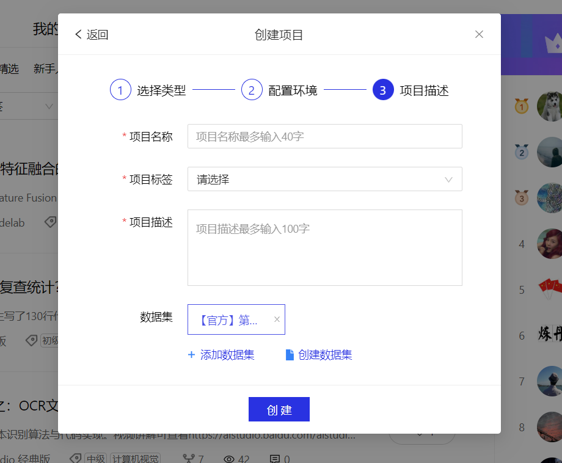
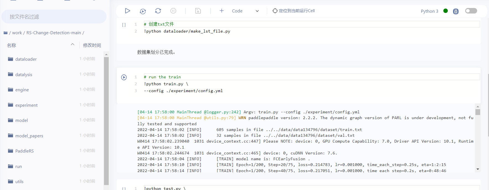

# RS-Change-Detection

## 使用

### 1. 创建AI Studio环境



* 将官方的数据集导入

### 2. 下载PaddleRS[源码](https://github.com/faye0078/PaddleRS-addModels)，该项目源码（AI Studio 使用git速度极慢）并上传到AI Studio中的**work**文件夹中

### 3. 使用AI Studio的内置命令行解压RS-Change-Retection到work文件

```bash
unzip RS-Change-Detection-main.zip
```

### 4. 打开项目中的run.ipynb文件，逐个运行cell即可



### 5. 在experiment/config.yaml文件中修改模型种类

* 目前可运行PaadleRS中的**"BIT", "DSIFN", "STANet", "SNUNet", "DSAMNet", "FCSiamConc", "FCSiamDiff", 'FCEarlyFusion'**模型，模型参数在**model/model_maker.py**中修改，模型对应的论文在model_papers文件夹中

### 6. 增加模型

* 增加模型需要在PaddleRS库中完成，在**/paddlers/custom_models/cd/**中添加相应模型，并逐层实现接口，重新编译安装。
